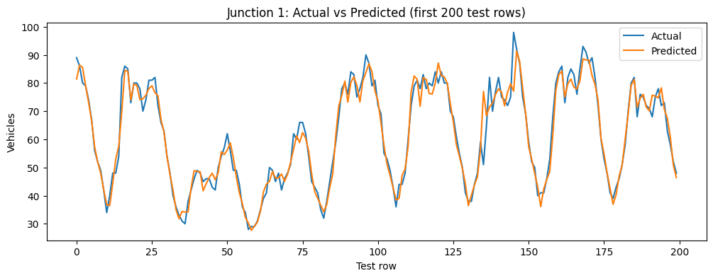
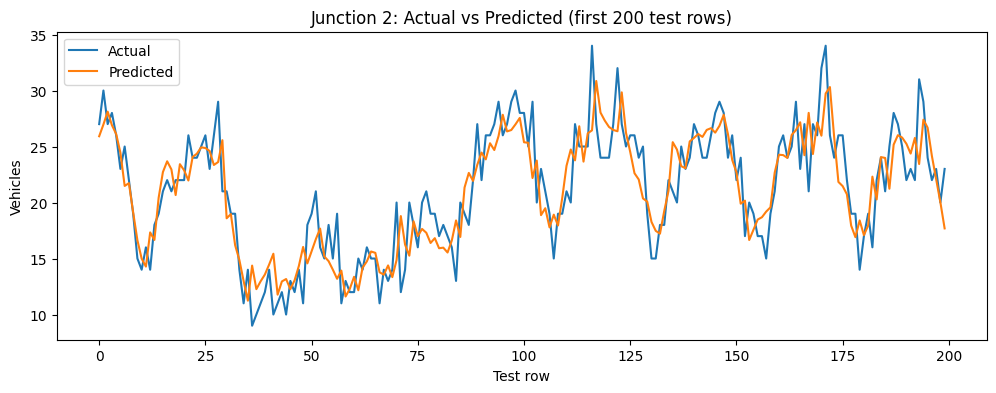
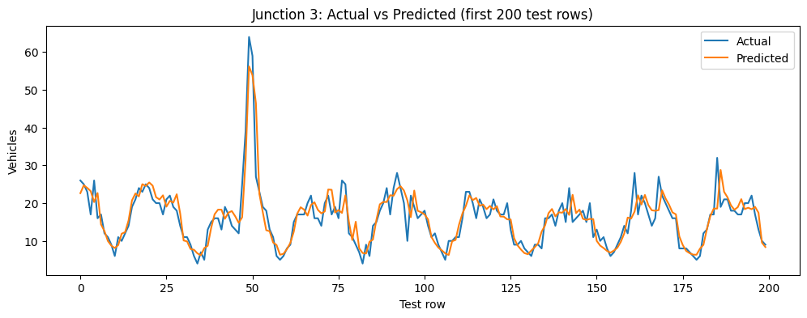
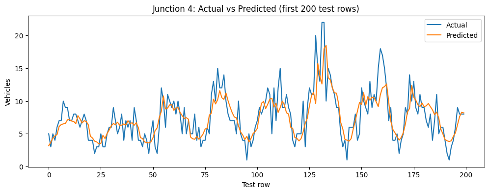

# Traffic Forecasting (1-Hour Ahead)

Forecast next-hour traffic volume (`Vehicles`) for each junction using leakage-safe time-series features and XGBoost.

## What this project does

- Predicts `Vehicles(t+1)` from historical hourly records.
- Uses per-junction chronological train/test split (80/20).
- Compares against a naive baseline (`next = current`).

## Data

- Source: `data/traffic.csv`
- Columns: `DateTime`, `Junction`, `Vehicles` (and optional `ID`)
- Scale: ~48k rows across 4 junctions

## Modeling approach

- Time features: hour, day of week, weekend flag, month
- Lag features: 1, 2, 3, 6, 12, 24, 48, 168
- Rolling features (shifted to avoid leakage): mean(3/6/24), std(24)
- Model: `XGBRegressor`

## Results

### Overall

| Model | MAE | RMSE |
|---|---:|---:|
| Naive baseline (next = current) | 4.154 | 6.168 |
| XGBRegressor | 3.124 | 4.988 |

### Per junction

| Junction | Baseline MAE | Baseline RMSE | Model MAE | Model RMSE | n_test |
|---:|---:|---:|---:|---:|---:|
| 1 | 6.260 | 8.098 | 4.500 | 6.488 | 2885 |
| 2 | 2.939 | 3.736 | 2.362 | 2.996 | 2885 |
| 3 | 3.715 | 6.480 | 2.837 | 5.322 | 2885 |
| 4 | 2.598 | 3.548 | 1.994 | 2.911 | 835 |

Artifacts are written to:

- `outputs/metrics_overall.csv`
- `outputs/metrics_per_junction.csv`
- `outputs/test_predictions.csv`

## Prediction plots (test split)

### Junction 1



### Junction 2



### Junction 3



### Junction 4



## Reproduce

```bash
# install deps
uv sync

# execute all notebook cells
UV_CACHE_DIR=.uv-cache uv run jupyter nbconvert \
  --to notebook --execute notebooks/Untitled.ipynb \
  --output Untitled.executed.ipynb --output-dir notebooks

# extract matplotlib plots from executed notebook outputs
UV_CACHE_DIR=.uv-cache uv run python src/extract_notebook_plots.py
```
